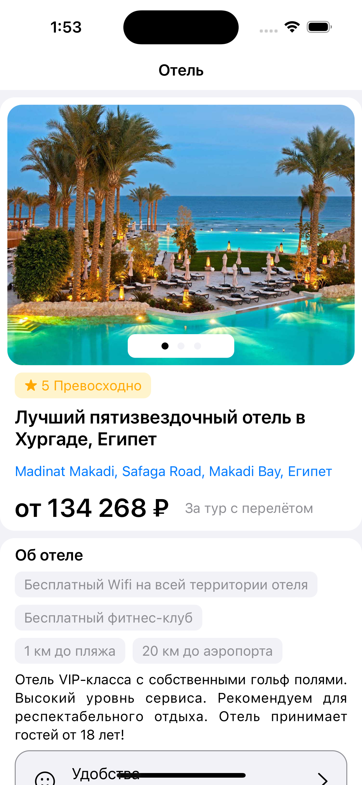
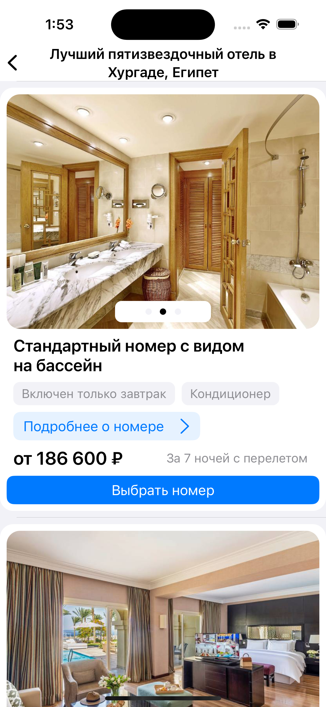

<div align="center">

</div>

## Task

Реализовать приложение согласно [макету](https://www.figma.com/file/33MKMNqJedmRgipHlpsqaf/iOS?type=design&node-id=0-1&mode=design)

## Result

### [Video](https://www.youtube.com/watch?v=SAXTwFr7Ce4&list=LL&index=1)





## Getting Started

```
# Move into a directory to store the project
cd ~/Developer
# Clone project
git clone https://github.com/logunkov/SletatRu.git
# Move into Project directory
cd ./SletatRu
# Open a project in Xcode 
```

## Component Libraries
- [x] Написано на Swift 5.
- [x] Поддерживается версия iOS 16
- [x] Зависимостей от сторонних библиотек нет.
- [x] Необходим Xcode 14 или выше.
